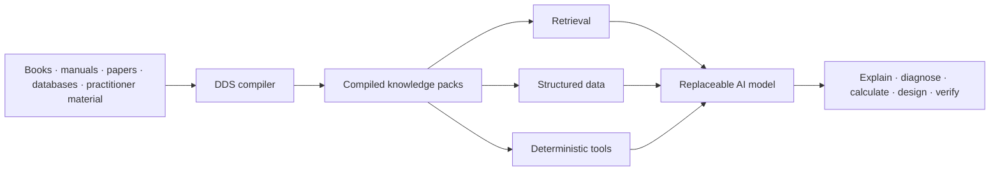

# DOOMSDAY DATA SET (DDS)

> **If the network disappeared tomorrow, what knowledge would an AI actually need in order to remain useful?**

DDS is an attempt to preserve the *working structure* of human technical knowledge — not billions of rendered pages, and not a civilisation-sized model.

A manual, textbook or paper is a human-facing container. The useful information inside it may be prose, procedures, equations, tables, component relationships, charts, diagrams, measurements and source claims. DDS treats those things as **compiler input** and turns them into compact, inspectable, machine-usable knowledge packs.

The model is replaceable. The knowledge is not.

**Current status:** architecture/specification + reference examples. DDS does **not** yet have a production compiler or released corpus.

## The idea in one screen



A PDF is not sacred. If a 40 MB service manual contains a wiring diagram, a torque table and a diagnostic procedure, DDS should preserve the **technical meaning** of those things in the smallest robust form that still lets a machine retrieve, validate, reconstruct and use them.

```text
PDF prose           → structured text + provenance
table / parts list  → typed records
chart               → values + axes + plotting specification
schematic           → component graph + SVG + semantics
procedure           → ordered steps + branches + checks + failure modes
equation            → machine-readable maths + units + definitions
```

That is the core idea: **compile information, not files**.

## Why bother?

A large language model already contains an extraordinary amount of approximate knowledge. But model weights are a poor place to keep exact specifications, revision-sensitive procedures, provenance, diagrams, tables and anything that must remain inspectable.

A conventional archive solves the opposite problem: it preserves the files, but leaves most of their technical structure implicit.

DDS sits between them.

The durable asset is a semantic corpus that can outlive any particular model, embedding system or computer. A local model retrieves evidence from it, queries exact records, calls deterministic tools when calculation is preferable to guessing, and tells the user what came from a source, what was calculated and what remains uncertain.

The long-term target is an offline technical capability stack:

```text
identify problem
→ retrieve evidence
→ inspect / measure
→ calculate
→ design
→ simulate or check
→ manufacture / repair
→ test
→ revise
```

In other words: not “ChatGPT over some PDFs”, but a local system that can still do useful technical work when the internet, cloud services or specialist access are unavailable.

## A tiny concrete example

The repository now contains a deliberately small, synthetic reference pack:

**[examples/12v-pump](examples/12v-pump/README.md)**

It starts with a short fictional service note for a 12 V circulation-pump circuit and shows the *target DDS representation* of the same information as structured components, topology, a branching diagnostic procedure, provenance and a pack manifest.

```text
synthetic service note
        ↓
  manually compiled reference
        ↓
manifest.json
components.json
topology.json
procedure.yaml
provenance.json
```

This example is **not claimed to have been generated by a finished DDS compiler**. It exists so the architecture is visible and criticisable now, rather than living only in design prose.

The interesting property is that the resulting objects can be used differently from the original page. A runtime can ask things like:

- What protects pump P1?
- Which relay terminal feeds it?
- If 12.4 V is present at the pump while commanded on, what branch of the procedure applies?
- Which source statement supports that branch?
- Can the circuit be rerendered without retaining a screenshot of the original diagram?

That is the shape DDS is trying to generalise across real technical domains.

## Visual knowledge is data too

One of the more important DDS ideas is that many technical images are not fundamentally images.

A wiring schematic is largely topology, component identity, terminal numbers, ratings, labels and geometry. A chart is values, axes, units and annotations. An exploded drawing contains part identities, adjacency, order and orientation.

So DDS separates **meaning**, **geometry** and **rendering**.

Where possible, visuals should be reconstructed deterministically from structured representations and then tested for **functional equivalence**, rather than judged by pixel similarity. A clean rerendered schematic can be technically equivalent — or better — than a degraded scan while occupying far less space and being directly queryable by software.

See [Visual knowledge compilation and reconstruction](docs/04-visual-reconstruction-pipeline.md).

## What belongs in the model — and what does not

DDS is deliberately model-agnostic.

The model should be good at reasoning, orchestration, tool use, uncertainty and long-horizon procedures. It should **not** be expected to memorise the entire DDS corpus.

```text
exact source facts     → corpus / database
calculations           → deterministic tools
search and evidence    → retrieval / reranking
reasoning and planning → model
```

This separation matters because every layer can improve independently. A better model can replace an older one without recompiling civilisation. Embeddings can be rebuilt. Hardware can change. The corpus and provenance remain stable.

## What would count as DDS working?

The first serious vertical slice is intentionally smaller than the final ambition. It needs to prove that a bounded rights-clear source set can be compiled into canonical representations, retrieved and queried locally, used with deterministic tools, and evaluated against explicit ground truth.

Success is not “the chatbot sounds clever”. It is measurable things: correct retrieval, correct source use, exact structured lookups, valid tool calls, coherent multi-step procedures, sensible handling of missing/conflicting evidence, and reproducible behaviour across different model profiles.

See [Evaluation and benchmarking](docs/07-evaluation-and-benchmarking.md) and the [roadmap](ROADMAP.md).

## Repository map

| Start here | What it contains |
| --- | --- |
| **[Reference example](examples/12v-pump/README.md)** | A tiny source → compiled-pack example you can inspect directly |
| **[Core DDS paper](docs/01-core-dds-paper.md)** | The full project thesis and architecture |
| **[Design decisions](docs/00-design-decisions.md)** | Architectural commitments already made |
| **[Corpus taxonomy](docs/02-corpus-taxonomy-and-acquisition.md)** | What should and should not enter DDS |
| **[Compilation pipeline](docs/03-ingestion-and-compilation-pipeline.md)** | How heterogeneous sources become canonical DDS representations |
| **[Visual compilation](docs/04-visual-reconstruction-pipeline.md)** | Diagrams, charts, schematics and photographs |
| **[Model and inference](docs/05-model-and-inference.md)** | Retrieval / DB / tools / model boundary |
| **[Hardware architecture](docs/06-hardware-architecture.md)** | Home-server through later field-system direction |
| **[Evaluation](docs/07-evaluation-and-benchmarking.md)** | How DDS capability should actually be measured |
| **[Model adaptation & compression](docs/08-model-adaptation-and-compression.md)** | Why compact reasoning models may matter for deployment |
| **[Collaboration brief](docs/09-collaboration-brief.md)** | Interfaces for research and systems collaborators |
| **[DDS × Bonsai proposal](docs/10-bonsai-evaluation-proposal.md)** | One concrete compressed-model evaluation proposal |

## The larger ambition

The name is deliberate.

DDS asks what a technically capable person and machine would need if normal information infrastructure became unreliable: not merely facts, but procedures, relationships, equations, failure modes, diagrams, provenance, tools and enough intelligence to put them together.

The working target is a compact, versioned body of high-value technical knowledge that remains useful on local hardware and can be mirrored, rebuilt and improved without being tied to a vendor or model generation.

The first versions can run on ordinary home/server hardware. A rugged low-power field machine is a later deployment problem, not a separate architecture.

## Collaboration and model compression

Compact local models, retrieval under tight memory budgets, ultra-low-bit inference and low-power hardware are useful to DDS because they can shrink the machine required to operate the same external knowledge system.

They are not the project itself.

DDS can therefore act as a demanding systems workload: evidence-grounded retrieval, exact structured facts, deterministic tool use, long procedural trajectories, conflict handling and degraded/offline operation. Specific model families — including the proposed Bonsai evaluation — are candidates to test against that workload.

## Licence

DDS is intended to be open and reusable.

Software, schemas and build tooling are Apache-2.0. DDS-authored documentation and data/content are CC BY 4.0. Third-party source material retains its own rights and must carry explicit provenance/licensing metadata.

See [LICENSE.md](LICENSE.md) and [NOTICE](NOTICE).
