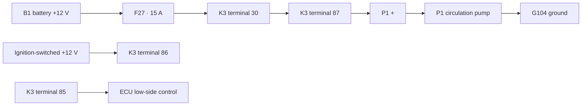

# DDS reference example: 12 V circulation pump

This is a deliberately tiny **synthetic** example showing what DDS means by compiling information rather than preserving a source page as the primary artefact.

Nothing here is taken from a real vehicle or manufacturer manual. The source note is DDS-authored test material, so the example is rights-clear and can evolve with the specification.

> This is a **target representation**, manually authored for the reference example. It is not evidence that the DDS compiler already exists.

## 1. Human-facing source

Start with [source.md](source.md). It contains the sort of mixed information that might normally appear across prose, a wiring figure and a troubleshooting section:

- component names and ratings;
- electrical topology;
- a diagnostic procedure;
- thresholds and expected measurements;
- branching actions.

A normal archive could simply preserve that document. DDS instead asks what structure a machine needs in order to use the same knowledge reliably.

## 2. Compiled target

The same information is represented in several explicit objects:

| File | Purpose |
| --- | --- |
| [manifest.json](compiled/manifest.json) | pack identity, version, contents and validation state |
| [components.json](compiled/components.json) | typed component identities and properties |
| [topology.json](compiled/topology.json) | machine-readable electrical relationships |
| [procedure.yaml](compiled/procedure.yaml) | ordered diagnostic steps, conditions and branches |
| [provenance.json](compiled/provenance.json) | links compiled claims back to the source note |

The split is intentional. A relay terminal relationship is not stored as prose merely because the original happened to describe it in a sentence.

## 3. What becomes possible

From the structured representation, a DDS runtime could answer an exact lookup such as:

```text
Q: What protects pump P1?

DB/topology result:
F27 → rating 15 A → feeds relay K3 contact 30 → K3 contact 87 feeds P1 positive.
```

Or it could combine a measurement with the procedure:

```text
Observation:
Pump commanded ON.
Measured voltage across P1 = 12.4 V.
Pump does not run.

Procedure branch:
Supply is present at the load.
Inspect P1 ground path / connector and test P1 itself.
Do not continue upstream voltage diagnosis unless the load-side checks fail.
```

The model does not need to invent the circuit, remember the fuse rating or perform the branching logic from vague prose. It can retrieve explicit evidence and reason over it.

## 4. The topology



A production DDS representation might additionally carry SVG geometry and rendering metadata. The important point here is that **topology exists independently of pixels**.

## 5. Provenance survives compilation

Compiled objects should remain traceable to their source.

For example, the claim that F27 is rated at 15 A links back to the exact source section that states it. So a runtime can distinguish:

```text
source fact:      F27 = 15 A
measured fact:    P1 = 12.4 V while commanded ON
inference:        upstream supply path is probably intact
next action:      inspect/test load and ground path
```

That separation is central to DDS.

## Why this example exists

The full project is much larger than a six-component pump circuit. This example exists because architecture diagrams alone make DDS sound more abstract than it is.

A real first vertical slice should do the same thing with a bounded, rights-clear technical domain and an actual compiler/evaluator:

```text
source material
→ extraction
→ canonical DDS objects
→ validation
→ pack
→ retrieval / DB / tools
→ model
→ scored technical tasks
```

Until then, this directory is the concrete reference shape the implementation can be built against.
